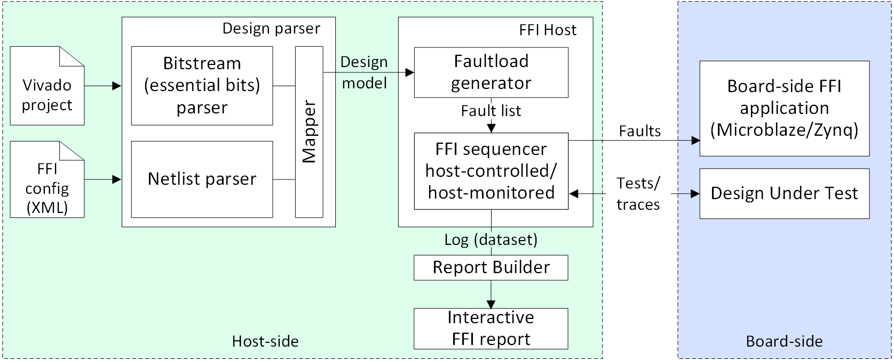
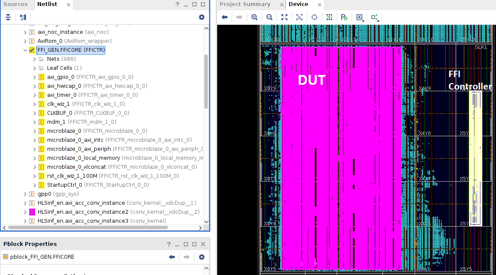
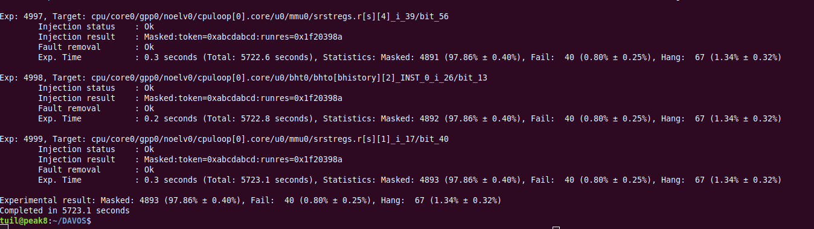
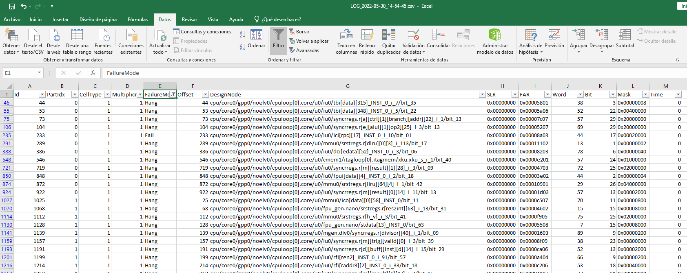
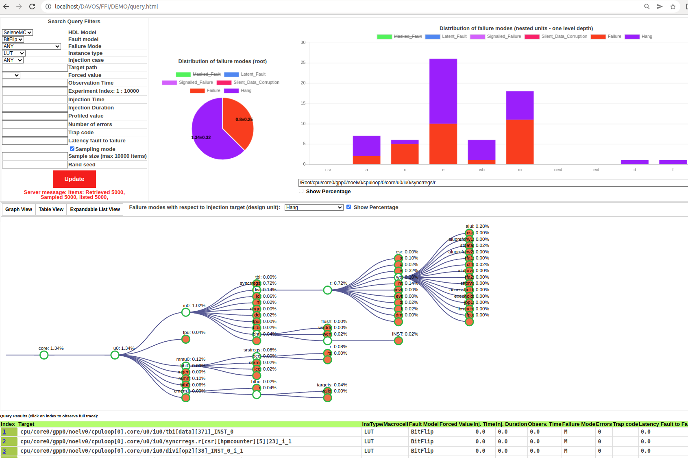

# DAVOS - a fault Injection toolkit for dependability assessment, verification, optimization and selection of hardware desings. #


DAVOS is an open-source fault injection toolkit that automates dependability-driven processes of the semicustom design flow, 
including:
- *Dependability assessment* of HW designs at different stages of design flow:
    - RTL and gate-level models by means of simulation-based fault injection (*SBFI*);
    - FPGA prototypes by means of FPGA-based fault injection (*FFI*).
- *Verification* of fault tolerance mechanisms.
- *Dependability Benchmarking* of IP cores, EDA tools, and implementation technologies for the selection of most suitable (robust) alternatives.
- *Dependability-driven design space exploration (DSE)* for optimally tuning/configuring IP cores and EDA tools, in order to reach the best possible robustness features of HW implementations. 

DAVOS comprises a set of standalone tools and supplementary modules, as depicted below: 

 

---

## 1. FPGA fault injection tool (DAVOS-FFI)
   A bit-precise FFI tool for automated dependability/security assessment of FPGA prototypes.
   Supports hierarchical FFI experiments where any node in the DUT tree can be targeted at the granularity of individual 
   netlist cells (LUTs, registers, BRAM/LUTRAM cells, etc). Implements the bit-accurate FFI methodology described in [1]. 
   
   ### Main features
   DAVOS-FFI tool emulates SEUs in FPGA prototypes by manipulating the content of FPGA configuration memory (CM) at runtime. 
   The low-level fault injection operations (CM manipulations) are controlled directly from the target FPGA using a Xilinx Microblaze or Zynq IPs as an on-chip FFI controller.
   This allows to reduce the fault injection latency to the minimum. When using Zynq devices the CM content is accessed through the PCAP port, 
   otherwise (Artix/Kintex/Virtex devices) the ICAP is used.

   The considered fault models include:
- Bit-flips in changeable memory cells that manifest as transient faults (soft-errors) in registers, BRAM, LUTRAM;
- Bit-flips in non-changeable CM (essential bits) that manifest as permanent faults in combinational logic and routing 
      (stuck-at, short, open, bridging) in the absence of CM scrubbing;
   
The fault targets are selected attending to a set of filters, such as hierarchical design scope, Pblock/area (floorplan coordinates), 
   type of netlist cells.
 
The modular DAVOS FFI library allows building custom FFI setups for DUTs of any complexity.  
Current DAVOS distribution offers two preconfigured FFI setups: 
- Controlled from the host PC, suitable for DUTs requiring debug link wih the host (e.g. Cobham Gaisler NOELV SoC debugged using GRMON tool);
- Controlled from the target FPGA for fully embedded FFI experiments, suitable for those DUTs that can be tested without host support;


DAVOS-FFI currently supports Xilinx 7-series, Ultrascale and Ultrascale+ FPGAs and Zynq SoCs. 
DAVOS-FFI allows speeding-up FFI experiments using iterative statistical sampling of fault space, and multiprocessing on the stacks of FPGA evaluation boards.




### Get started

A typical FFI experiment comprises the following five steps.

1. Include an FFI controller into the FPGA prototype. 
   
   Invoke a *Microblaze.tcl* script from the 'DAVOS/FFI/FFI_Microblaze/HDL' folder to load a complete Microblaze-based FFI controller IP into the Vivado project.
   Instantiate the FFI controller within the design wrapper as follows:
   

```text
FFI_GEN: if (FAULT_INJECTOR_ENABLE = 1) generate
    FFICORE: component FFICTR
         port map (
            clk_in => gen_clk,      --input clock
            reset => rst,           --input reset
            CLK_O_0 => ffi_clk,     --output FFI-controlled clock for the DUT
            RST_O_0 => ffi_rst,     --output FFI-controlled reset for the DUT 
            GPIO_EXT(31 downto 0) => ffi_gpio_in --GPIO bus for DUT test vectors
        );
end generate;
```
Implement the design, generate a bitstream. It is recommended to place an FFI controller into a dedicated area on the design floorplan (Pbock)
in order to prevent undesired interference with the DUT during FFI experiments.




2. Adapt the testbench to the DUT.

To evaluate the effects of injected faults on the DUT behaviour the DAVOS user should adapt a testbench service to the DUT.
Such testbench service interacts with the FFI tool though a TCP socket, performing two operations on the request of an FFI tool:
- 0x01 - Execute the workload, trace the results and return a 'Status: {failure mode}', where the 'failure mode' is the outcome of an FFI run. 
- 0x02 - Reset the DUT to the initial state, return 'Status: {Ok/Fail}'

An example of a testbench service for a Cobham Gaisler NOELV design is available in the 'DAVOS/testconfig/testbench.do' file.

   
3. Configure the faultload parameters.

The faultload parameters are grouped under the *FFI* tag of master DAVOS configuration template (tetsconfig/Selene.xml).
The 'dut_scope' is a hierarchical filter used to select a DUT module in which faults are to be injected, e.g. CPU core[0] in the listing below.
The 'pblock' is the area filter to contrain the fault injection scope attending to floorplan coordinates,
defined in terms of Bottom-Left and Top-Right Tile coordinates.
The 'target_logic' filters the fault targets attending to the type of nestlist cells, adopting one of the following values: 
FF - registers, LUT - lookup Tables, BRAM - block RAMs, TYPE0 - all essential bits (attending to EBD bitmask).
The 'Fault multiplicity' attribute configures the number of bit-flips injecting during a single FFI run.
The 'sample_size_goal' configures the maximum number of FFI runs to execute.
The 'error_margin_goal' configures the error margin threshold to be reached during the iterative sampling of fault space.
The 'dut_script' specified the command line script to invoke the testbench service.

```xml
<FFI
    dut_scope          = "cpu/core0/gpp0/noelv0/cpuloop[0].core"
    pblock             = "pblock_cpuloop[0].core:tiles:X2Y302:X90Y359"
    target_logic       = "LUT"
    fault_multiplicity = "1"
    sample_size_goal   = "5000"
    error_margin_goal  = "0.5"            
    injection_time     = "1"
    dut_script         = "grmon -u -uart /dev/ttyUSB1 -c /home2/tuil/DAVOS/testconfig/testbench_hls_v2.do"
>
</FFI>

```

4. Invoke the DAVOS-FFI tool from the command line terminal.
```commandline
DAVOS/> python FFI_tool.py testconfig/Selene.xml
```
Wait for the completion of an FFI experiment.


Upon completion the resulting FFI trace will be available in the *DavosGenerated/LOG.csv* file.  
This file details the fault configuration (targeted DUT node, injeciton time, fault multiplicity), and resulting experimental outcome (failure mode).



5. Query and visualize results. 
   
In addition, all FFI results collected during experimentation are saved into an SQLite dataset. 
The results from this dataset can be queried and visualized by means of a DAVOS web-based UI (as depicted below). 



---

## 2. Simulation-based fault injection tool (DAVOS-SBFI): 

  Automates dependability assessment and verification of HDL models at RTL and gate-level (post-synthesis / post-place-route) 
  after the SBFI methodolofy described in [1]. 
    Preconfigured for Mentor Graphics' ModelSim/QuestaSim simulator.
    Supports custom fault dictionaries for any third-party library of technology-specific macrocells.
    Speeds-up SBFI experiments by means of iterative statistical fault injection, checkpointing, 
    multi-level fault injection, multi-core and GRID-based multiprocessing.
    

## 3. Implementation support tool: 

  Automates translation of RTL designs into the target implementation technology (e.g. FPGA bitstream) by running any custom implementation flow defined by the designer.
  For each obtained implementation it retrieves the performance, power consumption, and area/utilization (PPA) features.


## 4. Supplementary DAVOS modules  

### 4.1. PPAD evaluation engine: 

  Automates evaluation of PPA and dependability features of multiple parameterized HW design alternatives.
  Provides customizable PPAD evaluation pipeline, based on DAVOS-FFI, DAVOS-SBFI and implementation support tools.
  Multiple designs are evaluated in parallel using multicore/GRID systems, and stacks of FPGA evaluation boards.

  
### 4.2. Decision support tool: 

Automates those dependability-driven processes that evaluate multiple design alternatives, such as 
dependability benchmarking and dependability-driven design space exploration (DSE). 
  Implements DSE approaches describes in chapter 7 of [1], including:
    - DSE based on genetic algorithms (GA/NSGA), accelerated by means of iterative dependability-driven selection;
    - DSE based on the design of experiments (DoE), accelerated by means of iterative refinement of D-optimal designs.

    
### 4.3. Data Controller: 

 Manages internal data model of the DAVOS toolkit, being in charge of:
    - Synchronizing the dataflow between DAVOS modules;
    - Collecting experimental results; 
    - Performing object-relational mapping (ORM) between the internal data model and SQLite database; 
    - Providing an interface for querying experimental results from the datasets attending to a set of filters.


### 4.4  DAVOS Web-interface: 

 DAVOS UI is a collection of HTML5 and Javascript files (front-end) as well as python scripts (at the back-end) that 
 implement an interactive web interface for:
    - monitoring the status of each task executed by DAVOS, 
    - querying the results from the dataset, collected by DAVOS during SBFI/FFI experiments, attending to a set of filters configured by user;
    - visualizing obtained SBFI/FFI results within interactive web-based widgets that allow:
      - highlight the distribution of failure modes along the design tree;
      - indicate the weak points of the design (from the robustness viewpoint);
      - visualize the detailed FI traces, allowing to analyze the fault propagation path in the design.  

### 4.5 FPGA design parser
   
   Parses the bitstream, essential bits mask, logic location file, and the netlist of the Vivado design, relating them under an internal design model.
   Performs the bit-accurate mapping of essential bits with the hierarchical netlist to support bit-precise FFI.

## Compatibility and System Requirements
DAVOS supports Linux and Windows OS.

All DAVOS tools require a basic python 2.x distribution. Note: DAVOS is currently not compatible with python 3.x. 

Depending on use case following third-party tools are required:
- Simulation-based fault injection tool requires ModelSim/Questa simulator;
- Bit-accurate FPGA-based fault injection tool requires Xilinx Vivado suite; 
- Design Space Exploration based on statistical techniques (DoE) requires a Matlab statistical toolkit;
- Scenarios involving automated design implementation require corresponding EDA tools (e.g. Xilinx Vivado, ISE, etc);
- FPGA-based fault injection tool has been verified to work properly on a wide range of Xilinx 7-series FPGAs and Zynq SoC FPGAs;   

## Installation
Clone DAVOS repository to the working directory.
Interactive DAVOS UI requires to configure a web-server (Apache preferred). 
Ensure that Web-server is configured to execute CGI scripts, particularly python-scripts. In the 'httpd.conf' file (XAMMP control panel – button config in front of apache module):

– search for line Options Indexes FollowSymLinks and add ExecCGI, so the resulting line looks like this: *Options Indexes FollowSymLinks ExecCGI*

– search for #AddHandler cgi-script .cgi, uncomment (remove #), and append “.py” to this line, so the results looks like: *AddHandler cgi-script .cgi .pl .asp .py*

For more details refer to the user manual.
>User manual will be published soon


## Branches
- "master" branch contains the latest DAVOS version that integrates all recently added features;
- "DSE" branch contains the stable version of the DAVOS toolkit as it has been presented in the thesis https://doi.org/10.4995/Thesis/10251/159883. 


## Copyright
Copyright (c) 2018 Universitat Politècnica de València

Author / Developer: Ilya Tuzov (Universitat Politècnica de València)

DAVOS is released under the "MIT license agreement". 
Please check the LICENSE.txt file (that is included as a part of this package) for the license details.


## References

[1]. A PhD thesis describing the new fault injection methods used in the DAVOS toolkit, as well as the toolkit itself: https://doi.org/10.4995/Thesis/10251/159883

[2]. A tool description paper presented at the 48th Annual IEEE/IFIP International Conference on Dependable Systems and Networks (DSN'2018): https://doi.org/10.1109/DSN.2018.00042

[3]. A dataset illustrating the basic DAVOS use cases:   https://doi.org/10.5281/zenodo.891316


## Acknowledgement

- This work has been carried-out under the support of the "Programa de Ayudas de Investigación y Desarrollo" (PAID) de la Universitat Politècnica de València.
- Adaptation to the NOEL-V RISCV platform is currently supported by the:
  * SELENE project (www.selene-project.eu) funded by the European Unions Horizon 2020 research and innovation programme under grant agreement No. 871467, and
  * FRACTAL project (https://fractal-project.eu/) funded by the ECSEL Joint Undertaking (JU) under grant agreement No. 877056
    


